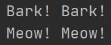

# Abstract:
- Allows to create a blueprint for other classes and a method allows to have a declaration but not an implementation
--------------

## Requirements:
- from abc import ABC, abstractmethod
- Inherit ABC class
- @abstractmethod over any method that is abstract
----------------

### Abstract Method
- Any subclass of the class must implement the method

#### Example:
```python
from abc import ABC, abstractmethod


class Animal(ABC):
    @abstractmethod
    def speak(self):
        pass


class Dog(Animal):
    def speak(self):
        return "Bark! Bark!"


class Cat(Animal):
    def speak(self):
        return "Meow! Meow!"


animal1 = Dog()
animal2 = Cat()

print(animal1.speak())
print(animal2.speak())
```
- Explanation:
  - Means that any subclass of Animal must implement the speak method

#### Result:

