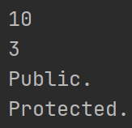
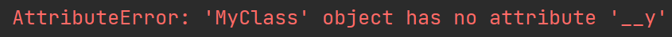

# Encapsulation:
- Allows wrapping data and methods that operate on the data within a unit
------------------

## Requirements:
- _ - for protected members
- __ - for private members

----------------------

### 1. Protected Members:
- Can only be called from the class and its subclasses

#### Example:
```python
class MyClass:
    def __init__(self):
        self.x = 10
        self._y = 3

    @staticmethod
    def public_method():
        print("Public.")

    @staticmethod
    def _protected_method():
        print("Protected.")


obj1 = MyClass()

print(obj1.x)
print(obj1._y)

obj1.public_method()
obj1._protected_method()
```
- Explanation:
  - It's giving hints because Python knows it's protected members

#### Result:


------------------------

### 2. Private Members:
- Can only be called from classes

#### Example:
```python
class MyClass:
    def __init__(self):
        self.x = 10
        self.__y = 3

    @staticmethod
    def public_method():
        print("Public.")

    @staticmethod
    def __private_method():
        print("Private.")


obj1 = MyClass()

print(obj1.x)
print(obj1.__y)

obj1.public_method()
obj1.__private_method()
```
- Explanation:
  - It will appear errors

#### Result:

