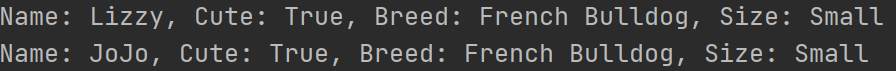

# Inheritance:
- One class to derive properties from another class
-----------

## Types of Inheritance:

### 1. Single Inheritance
- Allows a child class to inherit characteristics from a single parent class

#### Example:
```python
# Parent class:
class Dog:
    def __init__(self, is_cute, size):
        self.is_cute = is_cute
        self.size = size

        
# Child class:
class FrenchBulldog(Dog):
    def __init__(self, name):
        self.name = name
        self.breed = "French Bulldog"
        Dog.__init__(self, True, "Small")


dog1 = FrenchBulldog("Lizzy")
print(f"Name: {dog1.name}, Cute: {dog1.is_cute}, Breed: {dog1.breed}, Size: {dog1.size}")

dog2 = FrenchBulldog("JoJo")
print(f"Name: {dog2.name}, Cute: {dog2.is_cute}, Breed: {dog2.breed}, Size: {dog2.size}")
```
- Explanation:
    - Two classes (one parent and one child)
    - Inheritance is happening with ClassName(ClassName1) 
    - Taking parent properties with ClassName.\_\_int__

#### Result:


------------------

### 2. Multiple Inheritances:
- Allows a child class to inherit characteristics from multiple parent classes

#### Example:
```python
# Parent class:
class Animal:
    def __init__(self, kind):
        self.kind = kind


# Parent class:
class Size:
    def __init__(self, size):
        self.size = size


# Child class:
class Dog(Animal, Size):
    def __init__(self, name):
        self.name = name
        Animal.__init__(self, "Mammal")
        Size.__init__(self, "Small")


dog1 = Dog("Lizzy")
print(f"Name: {dog1.name}, Size: {dog1.size}, Kind: {dog1.kind}")

dog2 = Dog("JoJo")
print(f"Name: {dog2.name}, Size: {dog2.size}, Kind: {dog2.kind}")
```
- Explanation:
  - It's the same here but with more classes
    - if you want to inherit multiple classes on one class use "," between names

##### Result:


--------------------------

### 3. Multilevel Inheritance:
- Allows the child class to inherit the characteristics from the parent class that it inherits from its parent class

#### Example:
```python
# Parent class:
class Animal:
    def __init__(self, kind):
        self.kind = kind


# Child class:
class Size(Animal):
    def __init__(self, kind, breed):
        Animal.__init__(self, kind)
        self.breed = breed


# Grandchild class:
class Dog(Size):
    def __init__(self, name):
        self.name = name
        Size.__init__(self, "Mammal", "Small")


dog1 = Dog("Lizzy")
print(f"Name: {dog1.name}, Size: {dog1.breed}, Kind: {dog1.kind}")

dog2 = Dog("JoJo")
print(f"Name: {dog2.name}, Size: {dog2.breed}, Kind: {dog2.kind}")
```
- Explanation:
  - Each new class inherits the previous one

#### Result:


---------------------------------

### 4. Hierarchical Inheritance:
- Allows more than one child class to inherit the characteristics of the parent class

#### Example:
```python
# Parent class:
class Animal:
    def __init__(self, kind):
        self.kind = kind


# Child class:
class Dog(Animal):
    def __init__(self, name):
        self.name = name
        self.breed = "French Bulldog"
        Animal.__init__(self, "Mammal")


# Child class:
class Bird(Animal):
    def __init__(self, name):
        self.name = name
        self.breed = "Songbird"
        Animal.__init__(self, "Bird")


dog1 = Dog("Lizzy")
print(f"Name: {dog1.name}, Breed: {dog1.breed}, Kind: {dog1.kind}")

bird1 = Bird("JoJo")
print(f"Name: {bird1.name}, Breed: {bird1.breed}, Kind: {bird1.kind}")
```
- Explanation:
  - It's like single inheritance but with more classes

##### Result:


----------------------

### 5. Hybrid Inheritance:
- A mixture of more than one type of heritage

#### Example:
```python
# Parent class:
class Animal:
    def __init__(self, kind):
        self.kind = kind


# Child class:
class Breed(Animal):
    def __init__(self, kind, breed):
        Animal.__init__(self, kind)
        self.breed = breed


# Grandchild class:
class Dog(Breed):
    def __init__(self, name):
        self.name = name
        Breed.__init__(self, "French Bulldog", "Mammal")


# Grandchild class:
class Bird(Breed):
    def __init__(self, name):
        self.name = name
        Breed.__init__(self, "Songbird", "Bird")


dog1 = Dog("Lizzy")
print(f"Name: {dog1.name}, Breed: {dog1.breed}, Kind: {dog1.kind}")

bird1 = Bird("JoJo")
print(f"Name: {bird1.name}, Breed: {bird1.breed}, Kind: {bird1.kind}")
```
- Explanation:
  - Single and Hierarchical inheritance

#### Result:
