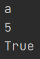
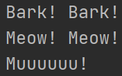
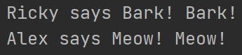
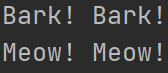

# Polymorphism:
- Allow objects of different types to be treated as if they share the same interface
------------------

## Types of Polymorphism:

### 1. Built-in Polymorphism
- Some functions like len(), sum() and str() demonstrate polymorphism

#### Example:
```python
print(len("Hello"))
print(len([12, 3, 5]))
```
- Explanation:
  - "Hello" - string
  - [12, 3, 5] - list
  
#### Result:


--------------------

### 2. User-defined Function Polymorphism
- Function can take multiple arguments with different type values

#### Example:
```python
def print_values(*args):
    for i in args:
        print(i)


print_values("a", 5, True)
```
- Explanation:
  - "a" - string
  - 5 - int
  - True - bool

#### Result:


--------------------

### 3. Polymorphism with Class
- You can treat objects from classes differently

#### Example:
```python
class Dog:
    @staticmethod
    def speak():
        print("Bark! Bark!")


class Cat:
    @staticmethod
    def speak():
        print("Meow! Meow!")


class Cow:
    @staticmethod
    def speak():
        print("Muuuuuu!")


animal1 = Dog()
animal2 = Cat()
animal3 = Cow()

for animal in (animal1, animal2, animal3):
    animal.speak()
```
- Explanation:
  - You can make tuple from objects

#### Result:


----------------------

### 4. Polymorphism with Class Inheritance
- A common practice in Python when using class inheritance and polymorphism

#### Example:
```python
# Parent class:
class Animal:
    def __init__(self, name):
        self.name = name

    def make_sound(self):
        pass


# Child class:
class Dog(Animal):
    def make_sound(self):
        return "Bark! Bark!"


# Child class:
class Cat(Animal):
    def make_sound(self):
        return "Meow! Meow!"


animals = [Dog("Ricky"), Cat("Alex")]

for animal in animals:
    print(f"{animal.name} says {animal.make_sound()}")
```
- Explanation:
  - Static methods can be used to implement a specific behavior that is not dependent on the state of the object
  - But in this case, make_sound() is meant to be implemented by each subclass with their own specific implementation

#### Result:


------------------

### 5. Polymorphism with Class and Function
- Allows greater flexibility and re-usability

#### Example:
```python
class Dog:
    @staticmethod
    def speak():
        return "Bark! Bark!"


class Cat:
    @staticmethod
    def speak():
        return "Meow! Meow!"


def animal_speak(animal):
    print(animal.speak())


animal1 = Dog()
animal2 = Cat()

animal_speak(animal1)
animal_speak(animal2)
```
- Explanation:
  - .speak() method of that instance, which returns the appropriate animal sound

#### Result:

