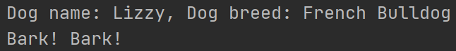
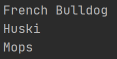
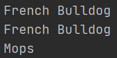
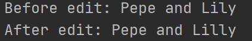
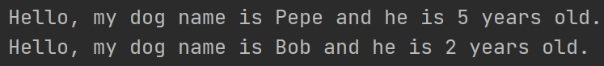
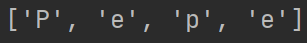
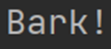
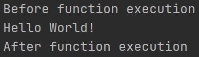

Object-oriented programming
---------------------------
1. &nbsp; [OOP]() <br />
<br />
2. &nbsp; [Process:]() <br />
   1. &nbsp; [Class]() <br />
   2. &nbsp; [Object]() <br />
<br />
3. &nbsp; [Types of Attributes:]() <br />
   1. &nbsp; [Instance Attribute]() <br />
   2. &nbsp; [Class Attribute]() <br />
<br />
4. &nbsp; [Types of Methods:]() <br />
   1. &nbsp; [Instance Method]() <br />
   2. &nbsp; [Class Method]() <br />
   3. &nbsp; [Static Method]() <br />
<br />
5. &nbsp; [Decorators:]()<br />
   1. &nbsp; [Built-in Decorator]()<br />
   2. &nbsp; [User-defined Decorator]()<br />
<br />
6. &nbsp; [Main Concepts:]()<br />
   1. &nbsp; [Inheritance]()<br />
      1. &nbsp; [Single Inheritance]()<br />
      2. &nbsp; [Multiple Inheritance]()<br />
      3. &nbsp; [Multilevel Inheritance]()<br />
      4. &nbsp; [Hierarchical Inheritance]()<br />
      5. &nbsp; [Hybrid Inheritance]()<br />
   2. &nbsp; [Polymorphism]()<br />
      1. &nbsp; [Built-in Polymorphism]()<br />
      2. &nbsp; [User-defined Function Polymorphism]()<br />
      3. &nbsp; [Polymorphism with Class]()<br />
      4. &nbsp; [Polymorphism with Class Inheritance]()<br />
      5. &nbsp; [Polymorphism with Class and Function]()<br />
   3. &nbsp; [Abstract]()<br />
   4. &nbsp; [Encapsulation]()<br />
      1. &nbsp; [Protected Members]()<br />
      2. &nbsp; [Private Members]()<br />

-----------------------
## 1. OOP:

- A way of structuring a program by grouping related properties and behaviors into separate objects
------------------
## 2. Process:

### Class
- Contains a blueprint or prototype (attributes and methods) from which objects are created

#### Example:
```python
class Dog:
    breed = "French Bulldog"

    def __init__(self, name):
        self.name = name

    def bark(self):
        print("Bark! Bark!")
```
- Explanation:
  - There is a class with name "Dog"
  - In this class there is class attribute ("breed")
  - \_\_init__ 
    - function that makes attributes independent of each object
  - self
    - keyword for reference to the current instance of the class and is used to access variables that belong to the class
  - And instance method bark
    - which is printing a string

--------------------
### Object
- An entity that has a state and behavior associated with it

#### Example:
```python
dog1 = Dog("Lizzy")

print(f"Dog name: {dog1.name}, Dog breed: {dog1.breed}")
dog1.bark()
```
- Explanation:
  - After created class we need to create object from this class
  - dog1 is an object from it with name "Lizzy"
  - print() 
    - to print attributes dog1 have
  -  We call the .bark() method

#### Result:


--------------------
## 3. Types of Attributes:
### Instance Attribute
- For each instance it can be a different attribute value

#### Example:
```python
class Dog:
    def __init__(self, breed):
        self.breed = breed


dog1 = Dog("French Bulldog")
print(dog1.breed)

dog2 = Dog("Huski")
print(dog2.breed)

dog3 = Dog("Huski")
dog3.breed = "Mops"
print(dog3.breed)
```
- Explanation:
  - There are 3 objects with different breed
  - You can change the attribute like dog3

#### Result:


----------------------------
### Class Attribute
- The value of the attribute applies to all instances in the class
#### Example:
```python
class Dog:
    breed = "French Bulldog"


dog1 = Dog()
print(dog1.breed)

dog2 = Dog()
print(dog2.breed)

Dog.breed = "Mops"
dog3 = Dog()
print(dog3.breed)
```
- Explanation:
  -  There are 2 objects with the same breed
  - You can change the breed attribute, but it will apply for all objects after the change

    
#### Result:<br />


------------------
## 4. Types of Methods:

### Instance Method
- Is bound to the instance of the class 
  - Able to modify the state of the object
  - Able to access and modify the class itself and its variables

#### Example:
```python
class Dog:
    def __init__(self, name):
        self.name = name

    def edit_name(self, edited_name):
        self.name = edited_name


dog1 = Dog("Pepe")
dog2 = Dog("Lily")
print(f"Before edit: {dog1.name} and {dog2.name}")

Dog.edit_name(dog2, "Lilly")
print(f"After edit: {dog1.name} and {dog2.name}")
```
- Explanation:
  - Here we are replacing the old name with new one

#### Result:


----------------------
### Class Method
- Is bound to the class 
  - Able to modify the state of the class
  - Able to access the variables of the class itself

#### Example:
```python
import datetime


class Dog:
    def __init__(self, name, age):
        self.name = name
        self.age = age

    def greet(self):
        print(f"Hello, my dog name is {self.name} and he is {self.age} years old.")

    @classmethod
    def from_birth_year(cls, name, birth_year):
        age = datetime.datetime.now().year - birth_year
        return cls(name, age)


dog1 = Dog("Pepe", 5)
dog1.greet()

dog2 = Dog.from_birth_year("Bob", 2021)
dog2.greet()
```
- Explanation:
  - This class can create objects with name and age
  - After created object we can call .greet method
    - Where it's printing string with respective names and years
  - @classmethod
    - decorator for defining a class method
  - cls
    - keyword for class reference
  - from_birth_year()
    - we are calculating what age is if the argument is a year
      - that is why datetime is imported
    - it's returning all needed data

#### Result:


-----------------------
### Static Method
- Is bound to the class 
  - Not able to modify the state of the class or object
  - Not able to access or modify the class itself and its instance variables

#### Example:
```python
class Dog:
    def __init__(self, name):
        self.name = name

    @staticmethod
    def spelling(name):
        list_words = []
        for word in name:
            list_words.append(word)

        return list_words


dog1 = Dog("Pepe")
print(dog1.spelling(dog1.name))
```
- Explanation:
  - Just like normal function but in class like method

#### Result:


-------------------------
## 5. Decorators:
- A way to modify the behavior of a class or function without changing its source code

### Built-in Decorator
- There are different decorators for different reasons like @staticmethod, @classmethod and so on

#### Example:
```python
class Dog:
    @staticmethod
    def speak():
        return "Bark! Bark!"

    
dog1 = Dog()
print(dog1.speak())
```
- Explanation:
  - They are easy to use and more readable code

#### Result:


---------------------
### User-defined Decorator
- Functions that take another function as an argument and then return the modified function

#### Example:
```python
def my_decorator(func):
    def wrapper():
        print("Before function execution")
        func()
        print("After function execution")
    return wrapper


@my_decorator
def say_hello():
    print("Hello World!")


say_hello()
```
- Explanation:
  - my_decorator - takes a function as input and returns another function
  
#### Result:
